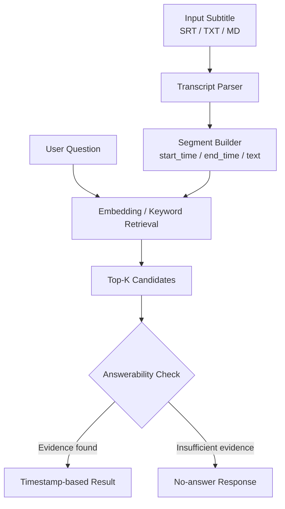

# VideoFind

## Overview

**一个基于字幕解析、语义检索和时间戳定位的长视频信息检索工具。**

VideoFind 是一个 **AI-powered video knowledge retrieval skill**。用户提供单个视频的字幕或文本并提出问题，VideoFind 会从内容中定位相关片段，返回时间戳、原文证据和匹配分数；证据不足时则明确拒答。

当前版本聚焦“从已有字幕中查找内容”，是一个可运行的本地 MVP，不是完整的视频理解系统。视频 URL 处理、语音识别和 LLM 生成均尚未实现。

## Problem

长视频包含大量有价值的信息，但知识被封装在时间轴中。用户知道自己想找什么，却往往不知道答案出现在哪一分钟，只能拖动进度条或从头观看。

这类问题常见于：

- 求职经验视频：快速找到简历、面试或项目经历相关建议
- 技术课程：回到某个概念、步骤或示例的讲解位置
- 产品分享：定位功能设计、用户研究或复盘内容
- 会议访谈：查找某个观点及其原始上下文

VideoFind 将字幕转换为可检索的时间片段，让用户从“观看整条视频”转向“提问并核验证据”。产品价值不只是返回一个答案，而是帮助用户更快找到、理解并验证视频中的信息。

## What You Get

一次有效检索会返回：

- **相关视频时间戳**：答案所在片段的起止位置
- **匹配内容片段**：与问题最相关的字幕 Segment
- **原始文本依据**：用于核对结果是否忠于视频内容
- **匹配分数**：展示当前检索模型的相似度结果

如果现有字幕没有足够证据，系统返回：

> 未找到与该问题高度相关的视频内容

## Current Features

### Subtitle Parsing

支持读取：

- `.srt` 字幕文件
- `.txt` 文本文件
- `.md` Markdown 文件
- `[00:08:14]`、`[00:08:14 - 00:08:30]` 等带时间戳文本

不同输入会被统一转换为结构化 Segment：

```python
Segment(
    start_time="08:14",
    end_time="08:30",
    text="项目经历应该突出个人贡献",
)
```

没有时间信息的纯文本也可以解析，但时间字段会显示为 `未提供`。

### Semantic Retrieval

- 默认使用 Embedding-based retrieval，对问题和字幕片段进行语义匹配
- 环境可用时加载多语言 MiniLM 模型 `paraphrase-multilingual-MiniLM-L12-v2`
- MiniLM 或相关依赖加载失败时，自动降级为本地 character n-gram 检索
- 另提供独立的 `keyword` 模式，便于对照或在简单场景中使用

### Answerability Checking

语义召回后，系统结合以下信号判断字幕是否包含足够证据：

- Top1 相似度分数
- Top1 与 Top2 的分数差距
- 查询关键词覆盖情况

当证据不足时，VideoFind 不会为了展示结果而强制返回时间段。这一门控用于降低“视频中没有答案，却仍返回最相似片段”的误导风险。

## Usage

建议使用 Python 虚拟环境：

```bash
python3 -m venv .venv
source .venv/bin/activate
pip install -r requirements.txt
```

在仓库根目录运行：

```bash
python3 -m src.cli \
  --transcript demo/sample_subtitles.srt \
  --question "简历项目经历怎么写？"
```

语义检索是默认模式，也可以显式调整检索模式、返回数量和阈值：

```bash
python3 -m src.cli \
  --transcript demo/sample_subtitles.srt \
  --question "简历项目经历怎么写？" \
  --search-mode semantic \
  --limit 3 \
  --threshold 0.50
```

示例输出：

```text
时间戳：03:18–04:12
相关内容：项目经历是简历最重要的部分。不要只写参与了某项目，
          要说清楚你负责什么、采取了什么行动，以及最后带来了什么结果。
原文依据：同上，直接来自命中的字幕片段
匹配分数：0.7407
```

实际 CLI 会以 Markdown 格式输出内容标题、摘要、原文依据和分数。当前摘要是提取式结果，即直接使用命中的字幕 Segment，不是 LLM 生成摘要。

## Architecture



工作流程可以概括为：

```text
Input Subtitle
      ↓
Transcript Parser
      ↓
Segment Builder
      ↓
Embedding / Keyword Retrieval
      ↓
Answerability Check
      ↓
Timestamp-based Result
```

当前 Segment 和 Embedding 都在单次进程中处理，没有持久化向量数据库。更详细的模块说明见 [docs/architecture.md](docs/architecture.md)。

## Demo

**用户输入**

> 我想找视频中讲项目经历的部分

**VideoFind 输出**

- 时间戳：`03:18–04:12`
- 匹配片段：项目经历是简历最重要的部分。不要只写参与了某项目，要说清楚你负责什么、采取了什么行动，以及最后带来了什么结果。
- 匹配结果：定位到 STAR 项目经历写法相关字幕，可回到对应时间核验

项目还提供直接命中、同义搜索和无答案拒答三个完整案例，见 [docs/demo.md](docs/demo.md)。

## Evaluation

当前评测基于 [`demo/sample_subtitles.srt`](demo/sample_subtitles.srt) 和 10 个问题，覆盖直接命中、同义改写与视频中不存在三类场景。结果采用人工预期时间段进行判定，完整记录见 [evaluation.md](evaluation.md)。

| 测试类型 | Answerability 优化前 | 优化后 |
|---|---:|---:|
| 直接命中 | 4/4 | 4/4 |
| 同义改写 | 2/3 | 2/3 |
| 无答案拒答 | 0/3 | 3/3 |
| **合计** | **6/10** | **9/10** |

现有验证包括：

- **Answerability 测试**：`tests/test_answerability.py` 覆盖有效答案接受、无答案拒绝和阈值调整
- **Semantic retrieval 评测**：记录 MiniLM 后端下直接命中与同义改写的 Top1 结果
- **无答案拒答评测**：检查三个字幕中不存在的问题是否被正确拒绝

`9/10` 是当前小型 Demo 数据集上的结果，不代表真实长视频或其他领域的泛化准确率。已知失败案例是一个有效同义问题被错误排序并拒答，这也说明下一阶段需要扩充数据集并继续校准召回与门控策略。

## Future Direction

以下是规划方向，**当前版本尚未实现**：

- 支持视频 URL 输入
- 自动获取公开视频字幕
- 使用 ASR 处理无字幕视频
- 基于检索证据生成 grounded LLM summary
- 自动生成结构化学习笔记
- 提供问答与引用联动的 Web UI
- 持久化 Segment Embedding，并扩展到更长内容与重复查询

## Requirements

- Python 3.10+
- `sentence-transformers`
- `torch`
- `numpy`

完整依赖见 [`requirements.txt`](requirements.txt)。首次运行 MiniLM 语义模式时需要下载模型；如果加载失败，程序会提示并使用 character fallback。
