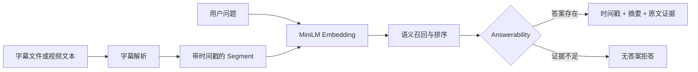

# VideoFind

**一个面向长视频内容的语义检索 AI Skill，支持时间定位、证据返回和无答案拒答。**

用户提供字幕文件或视频文本，再用自然语言提出问题；VideoFind 会定位最相关的视频片段，并返回时间戳、摘要、原文依据和匹配分数。

## Demo

以下结果来自同一份[示例字幕](demo/sample_subtitles.srt)，使用多语言 MiniLM 和默认 Answerability 阈值 `0.50`。

| 场景 | 用户问题 | VideoFind 输出 |
|---|---|---|
| 正确检索 | 简历项目经历怎么写？ | `03:18–04:12` · STAR 项目经历写法 · `0.7407` |
| 同义搜索 | 怎样在履历中体现自己的贡献？ | `03:18–04:12` · 明确职责、行动和结果 · `0.6712` |
| 无答案拒答 | 产品经理需要什么能力？ | 未找到与该问题高度相关的视频内容 |

每个案例的 Semantic Retrieval、Answerability 判断和证据输出详见 **[最终用户 Demo](docs/demo.md)**。

## 背景问题

教程、访谈、课程和直播通常很长。传统搜索只能找到“哪条视频可能相关”，整段摘要也无法回答“答案具体出现在哪里”。用户仍需拖动进度条反复观看，只为寻找其中一小段有用内容。

VideoFind 将视频字幕转换为可检索的时间片段，让用户直接对视频提问，得到可定位、可验证的答案。它适用于课程复习、访谈溯源、求职学习和产品发布会等长视频场景。

## 核心能力

1. **视频字幕解析**：解析 `.srt`、`.txt` 和 `.md`，统一转换为带起止时间的 Segment。
2. **Semantic Retrieval**：使用多语言 Embedding 理解问题与字幕片段的语义关系，而不只依赖关键词重合。
3. **时间定位与证据返回**：输出答案所在时间段、内容摘要、原文依据和相似度分数。
4. **Answerability 无答案判断**：证据不足时明确拒答，不为无答案问题强制生成时间戳。

## 系统架构



核心技术设计：

- **Embedding 模型**：`paraphrase-multilingual-MiniLM-L12-v2`
- **检索策略**：向量余弦相似度 TopK，保留关键词模式；模型不可用时降级为 character n-gram
- **可靠性判断**：综合 Top1 分数、Top1/Top2 分差和查询关键词覆盖率
- **可调配置**：默认 `threshold=0.50`，支持在召回率与误报率之间调整

## Evaluation

项目使用 10 个问题进行评测，覆盖直接命中、同义改写和视频中不存在三种情况。完整问题、分数与判断见 **[evaluation.md](evaluation.md)**。

| 测试类型 | 优化前 | 增加 Answerability 后 |
|---|---:|---:|
| 直接命中 | 4/4（100%） | 4/4（100%） |
| 同义改写 | 2/3（66.7%） | 2/3（66.7%） |
| 视频中不存在 | 0/3（0%） | 3/3（100%） |
| **总体准确率** | **6/10（60%）** | **9/10（90%）** |

Answerability 将无答案问题的正确拒答率从 0% 提升到 100%，总体准确率提升 30 个百分点。当前剩余错误是一条同义问题漏答，后续重点是改善召回与排序质量。

## 快速开始

安装依赖：

```bash
python3 -m pip install -r requirements.txt
```

运行语义检索 Demo：

```bash
python3 -m src.cli \
  --transcript demo/sample_subtitles.srt \
  --question "简历项目经历怎么写？" \
  --search-mode semantic \
  --threshold 0.50
```

首次运行会下载多语言 MiniLM 模型。启动信息会显示当前使用 MiniLM Embedding Search，还是 character fallback。

## Future Work

- **Whisper ASR**：直接从视频音轨生成带时间戳字幕，进一步降低输入成本。
- **Web UI**：支持上传、提问、结果展示和点击时间戳跳转播放。
- **向量数据库**：持久化大规模视频 Segment Embedding，支持跨视频检索和增量索引。
