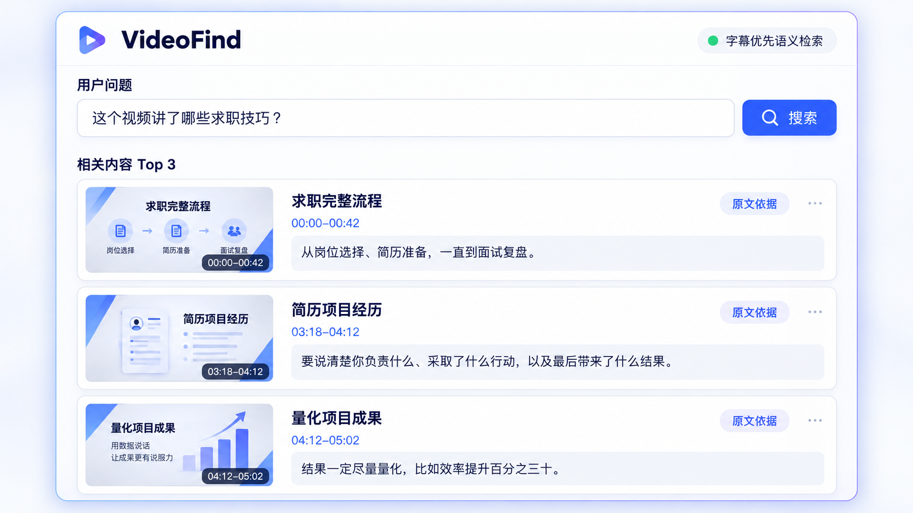
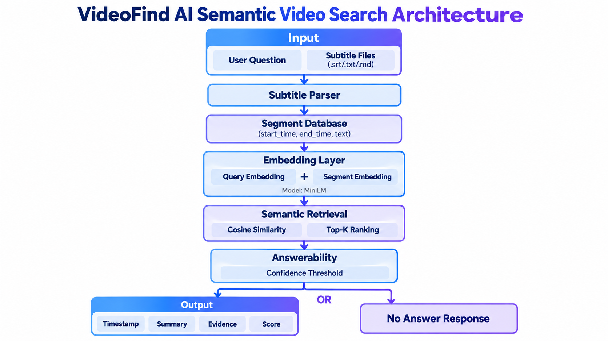

# VideoFind 🎬

**一个面向 AI Agent 的单视频知识检索 Skill，通过自然语言问题定位视频中的相关知识片段，并返回时间戳、原文证据和结构化 Markdown 结果。**


> Banner 表达“让长视频内容可搜索”的产品方向；当前可运行范围是单视频字幕 / ASR 内容的检索与证据定位，不包含视频画面理解。

VideoFind 解决的问题：

> 用户知道自己想找什么，但不知道视频中哪里真正回答了这个问题。

```text
Question → Video → Retrieval → Evidence → Timestamp
```

| 输入 | 输出 |
|---|---|
| 视频 URL / 本地字幕 + 自然语言问题 | 时间戳 + 原文证据 + 简短说明 + Markdown 结果 |

VideoFind 的核心不是播放或概括整条视频，而是**检索视频中的知识**。当前实现聚焦 **Retrieval + Evidence Layer**。

## 为什么做这个项目

长视频并不缺少信息，真正的问题是：视频内容与用户当前问题之间缺少直接对应关系。

当用户带着一个具体问题进入视频时，通常无法直接判断：

- 这个视频是否回答了我的问题？
- 如果回答了，相关内容具体在哪个片段？
- 哪段原文可以作为可验证的证据？

VideoFind 将“我想找什么？”转换成“视频中的哪一段可以回答这个问题？”，降低自然语言问题与视频知识片段之间的检索成本。

## Problem Statement

用户面对长视频时，可以正常播放、定位进度和倍速观看，但这些方式解决的是“如何浏览视频”，并没有直接解决：

> 视频中是否存在回答我当前问题的内容，以及具体在哪里？

因此，VideoFind 将问题定义为：

> **如何让用户通过自然语言问题，直接定位视频中与问题相关的知识片段，并获得可验证的原文证据？**

## Product Research / 用户研究

第一轮用户调研共收到 9 份回答，去除 1 份重复回答后，最终纳入 8 份独立有效样本。

核心发现是：

> **核心问题并不是用户单纯“不愿意看长视频”，而是长视频中的信息容易消费，但难以快速筛选、定位和复用。**

因此，VideoFind 当前重点解决：

- 信息检索
- 内容定位
- 时间戳定位
- 原文证据获取
- 结构化结果输出

完整研究记录：

- [第一轮用户调研](docs/user-research.md)
- [竞品分析、产品机会与 MVP 定义](docs/competitor-analysis-mvp.md)

## Product Opportunity / 产品机会

```text
用户提出具体问题
        ↓
不知道视频是否回答当前问题
        ↓
问题与视频内容之间的检索成本高
        ↓
Question → Video Evidence
        ↓
URL + Question → Timestamp + Evidence
```

现有产品常见能力集中在播放器章节、整条内容整理或知识源问答。VideoFind 选择更窄的机会点：建立**自然语言问题与单条视频证据片段之间的对应关系**。

它不是简单的视频摘要，而是面向具体问题的单视频知识检索。

## MVP Definition

当前 MVP 定义如下：

| 阶段 | 当前实现 |
|---|---|
| 输入 | Bilibili / YouTube URL、本地 SRT / TXT / MD，以及自然语言问题 |
| 内容获取 | 平台人工字幕、自动字幕；无字幕时使用 Whisper ASR fallback |
| 内容组织 | 将字幕或 ASR 结果转换为 Timestamped Segment |
| 检索 | Semantic Retrieval、Keyword Retrieval、Top-K 排序 |
| 证据判断 | Answerability 判断结果是否足以回答问题 |
| 输出 | 时间戳、原文证据、提取式简短说明、结构化 Markdown、可选结果文件 |

## 核心能力

### 1. 视频 URL / 本地字幕输入

- Bilibili
- YouTube
- 本地 `.srt`、`.txt`、`.md`
- 带时间戳的粘贴文本

需要登录态的 B站字幕，可在用户明确授权后通过 `--cookies-from-browser` 使用浏览器 cookies。

### 2. 智能字幕获取

```text
平台人工字幕 / 自动字幕
        ↓ 无可用字幕
Whisper ASR fallback
```

Whisper 默认使用 `small`，可通过 `--model` 选择其他模型。ASR 路径只下载音频，不下载完整视频。

### 3. Semantic Retrieval

默认使用 `paraphrase-multilingual-MiniLM-L12-v2` 将问题和字幕 Segment 转换为 Embedding，通过 cosine similarity 进行 Top-K 排序。模型加载失败时，语义模式会降级为本地 character n-gram。

### 4. Keyword Retrieval

通过 `--search-mode keyword` 使用独立关键词检索路径，适合原词定位和对照测试。

### 5. Answerability

综合 Top1 相似度、Top1/Top2 分差和查询关键词覆盖情况，判断召回结果是否包含足够证据。证据不足时返回：

> 未找到与该问题高度相关的视频内容

### 6. 时间戳定位

返回相关 Segment 的开始时间和结束时间，而不是只返回脱离视频时间线的文本。

### 7. Evidence

保留对应字幕原文和检索分数，让用户能够核对结果依据。

### 8. Markdown 输出

将视频信息、查询问题、推荐位置、原文证据和提取式内容说明整理为结构化 Markdown。

当前版本仅基于检索命中的字幕片段生成结构化 Markdown 笔记，不支持完整视频级总结。

### 9. 视频级缓存

按视频 ID 缓存元数据、字幕、ASR 音频和转录结果，减少重复下载和重复 Whisper 转写：

```text
cache/<video_id>/
├── metadata.json
├── audio.wav
└── transcript.json
```

### 10. 结果与缓存管理

支持：

- `--output`
- `--cache-info`
- `--remove-cache VIDEO_ID`
- `--clear-cache`

## 完整 Demo



> 图片是当前 CLI 能力的界面化展示，不代表 Web UI 已实现。内容来自仓库内的真实 Demo 字幕。

### 场景

用户正在查看一条求职学习视频，并提出具体问题：

> 简历项目经历怎么写？

### 输入

```bash
python3 -m src.cli \
  --transcript demo/sample_subtitles.srt \
  --question "简历项目经历怎么写？"
```

### 检索

VideoFind 将问题与视频字幕 Segment 匹配，并判断候选内容是否包含足够证据。

### 输出

| 时间戳 | 相关内容 |
|---|---|
| `03:18–04:12` | 项目经历需要说明个人职责、行动和结果。 |
| `04:12–05:02` | 项目成果应尽量量化。 |

原文依据：

> **03:18–04:12**：项目经历是简历最重要的部分。不要只写参与了某项目，要说清楚你负责什么、采取了什么行动，以及最后带来了什么结果。可以按背景、任务、行动、结果，也就是 STAR 的顺序来写。

> **04:12–05:02**：结果一定尽量量化，比如效率提升百分之三十、转化率增加八个百分点，或者服务了多少用户。

这些片段直接回答了“简历项目经历怎么写”。VideoFind 将自然语言问题定位到视频中的相关知识证据。更多案例见 [完整 Demo](docs/demo.md)。

## Architecture



> 上图概括核心 Retrieval + Evidence 子链路；包含 URL、Cache、平台字幕与 Whisper fallback 的完整当前流程如下。

```text
视频 URL / 本地字幕
        ↓
提取 video_id
        ↓
检查 Cache ── 命中 ──→ Timestamped Segment
        ↓ 未命中
获取平台字幕
        ↓ 无字幕
audio.wav → Whisper ASR
        ↓
Timestamped Segment
        ↓
Semantic / Keyword Retrieval
        ↓
Answerability
        ↓
Evidence
        ↓
结构化 Markdown
        ↓
终端输出 / 可选文件
```

当前核心技术重点是 **Retrieval + Evidence Layer**，不是 LLM Summary Layer。详细模块说明见 [架构文档](docs/architecture.md)。

## Installation

### 安装为 Codex Skill

在 Codex 中输入：

```text
帮我安装这个 skill：
https://github.com/hiohoisa/VideoFind
```

手动安装：

```bash
mkdir -p ~/.codex/skills
git clone https://github.com/hiohoisa/VideoFind.git ~/.codex/skills/videofind
cd ~/.codex/skills/videofind
```

### 安装运行依赖

推荐使用 Python 3.10–3.12：

```bash
python3 -m venv .venv
source .venv/bin/activate
pip install -r requirements.txt
```

Whisper 需要本机安装 `ffmpeg`。macOS：

```bash
brew install ffmpeg
```

首次使用 MiniLM 或 Whisper 时需要下载对应模型。

## CLI Usage

### 搜索 URL 视频

```bash
python3 -m src.cli \
  --url "VIDEO_URL" \
  --question "视频中什么时候讲到了项目经历？"
```

VideoFind 自动优先获取平台字幕；没有可用字幕时进入 Whisper ASR。

### 使用 B站登录字幕

```bash
python3 -m src.cli \
  --url "BILIBILI_URL" \
  --cookies-from-browser chrome \
  --question "问题"
```

支持 `chrome`、`safari`、`firefox` 和 `edge`。VideoFind 不会默认读取浏览器 cookies。

### 切换 Whisper 模型

```bash
python3 -m src.cli \
  --url "VIDEO_URL" \
  --question "问题" \
  --model medium
```

`base` 更快、准确率较低；`small` 平衡速度与效果并作为默认值；`medium` 更慢、通常更准确。

### 搜索本地字幕

```bash
python3 -m src.cli \
  --transcript demo/sample_subtitles.srt \
  --question "简历项目经历怎么写？"
```

### 保存 Markdown 结果

```bash
python3 -m src.cli \
  --url "VIDEO_URL" \
  --question "问题" \
  --output result.md
```

使用裸 `--output` 时，结果保存到 `outputs/<视频标题>_<问题>.md`，终端仍显示完整结果。

### 检索与缓存参数

```bash
python3 -m src.cli \
  --transcript demo/sample_subtitles.srt \
  --question "简历项目经历怎么写？" \
  --search-mode semantic \
  --limit 3 \
  --threshold 0.50

python3 -m src.cli --cache-info
python3 -m src.cli --remove-cache VIDEO_ID
python3 -m src.cli --clear-cache
```

## Project Highlights

- 从用户调研出发定义产品问题，再通过竞品分析收敛 MVP。
- 将自然语言问题转化为单条视频内的知识片段检索。
- 使用“平台字幕优先 + Whisper fallback”的双路径内容输入策略。
- 组合 Semantic Retrieval、Keyword Retrieval 与 Answerability，保留独立降级路径。
- 返回时间戳和原文证据，使检索结果可核对。
- 使用视频级缓存减少重复下载和重复 ASR。
- 通过 CLI 与 Markdown 输出构成可运行、可验证的 MVP。

评测记录见 [evaluation.md](evaluation.md)。该评测基于仓库内的小型 Demo 数据集，不代表真实长视频或跨领域泛化准确率。

## Limitations

当前版本不支持：

- 视频画面理解
- 图表、屏幕文字或手势理解
- 完整视频级 LLM 总结
- Grounded LLM Answer
- 多视频知识库或跨视频检索
- 实时视频分析
- Web UI
- 时间戳点击跳转
- Embedding 持久化或向量数据库

“AI辅助视频笔记”当前仅指：

> 基于检索命中的字幕片段生成结构化 Markdown 笔记。

它不代表完整视频 AI 总结。长视频 Whisper Bottleneck 仍会带来处理时间、内存和缓存空间开销。

## Future Work

以下均属于未来规划，不代表当前已经实现：

- Web UI
- 时间戳点击跳转
- 视频画面理解
- Grounded LLM Answer
- 完整视频学习笔记
- 多视频知识库
- 向量数据库与 Embedding 持久化
