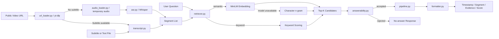

# VideoFind Architecture

VideoFind 优先从公开视频 URL 获取已有字幕；没有可用字幕时，下载临时音频并使用本地 Whisper ASR 转写。系统也可直接读取本地字幕文件，并统一完成 Segment 检索、证据判断和时间戳输出。

## Module responsibilities

| Module | Responsibility |
|---|---|
| `url_loader.py` | Use `yt-dlp` to fetch an existing manual or automatic subtitle track from a public video URL |
| `audio_loader.py` | Download temporary audio only when no usable subtitle track exists |
| `asr.py` | Use local Whisper to create timestamped text from temporary audio |
| `transcript.py` | Parse `.srt`, `.txt`, `.md`, and timestamped text into `Segment` objects |
| `semantic_search.py` | Rank Segment objects with MiniLM; fall back to character n-gram when necessary |
| `retriever.py` | Select semantic or keyword retrieval mode |
| `answerability.py` | Decide whether retrieved evidence is strong enough to return |
| `pipeline.py` | Orchestrate parsing, retrieval, gating, and result construction |
| `formatter.py` | Render results or the no-answer message as Markdown |
| `cli.py` | Expose the local command-line interface |

## Current boundary

The current pipeline can start with a public URL regardless of subtitle availability: it uses platform captions first and Whisper ASR as fallback. It downloads audio only for ASR and removes the temporary file afterward. It does not inspect visual frames, call an LLM, or persist embeddings.
