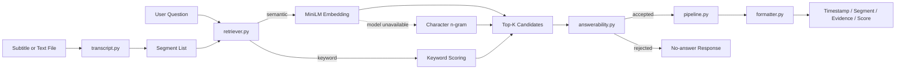

# VideoFind Architecture

VideoFind 当前是一个面向单个字幕文件的本地检索流程。系统负责解析字幕、召回相关 Segment、判断证据是否充分，并将结果格式化为带时间戳的 Markdown。

## Module responsibilities

| Module | Responsibility |
|---|---|
| `transcript.py` | Parse `.srt`, `.txt`, `.md`, and timestamped text into `Segment` objects |
| `semantic_search.py` | Rank Segment objects with MiniLM; fall back to character n-gram when necessary |
| `retriever.py` | Select semantic or keyword retrieval mode |
| `answerability.py` | Decide whether retrieved evidence is strong enough to return |
| `pipeline.py` | Orchestrate parsing, retrieval, gating, and result construction |
| `formatter.py` | Render results or the no-answer message as Markdown |
| `cli.py` | Expose the local command-line interface |

## Current boundary

The current pipeline starts with an existing subtitle or text file. It does not download videos, transcribe audio, inspect visual frames, call an LLM, or persist embeddings. Those are possible extension points rather than current capabilities.
