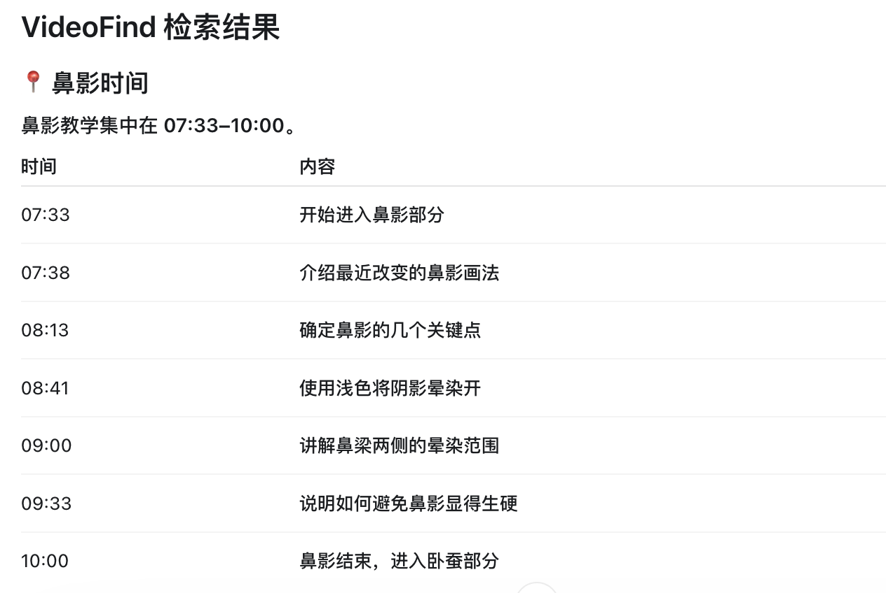
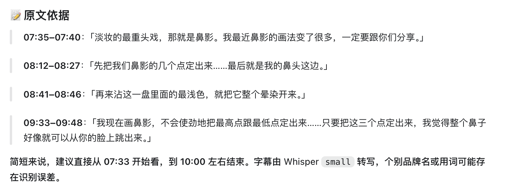

# VideoFind 完整 Demo

VideoFind 是一个面向 AI Agent 的单视频知识检索 Skill。用户输入视频 URL 和自然语言问题后，VideoFind 从视频字幕中定位相关知识片段，并返回时间戳、原文证据和结构化结果。

本案例使用一条 YouTube 美妆视频，寻找其中讲解“鼻影”的位置。截图来自当前实际处理结果，不代表 Web UI、完整视频 LLM Summary 或视频画面理解已经实现。

## 1. 输入视频与问题

用户向 VideoFind 提供：

- YouTube 或 Bilibili 视频 URL
- 想在视频中寻找的自然语言问题


这一步体现的是：**用户告诉 VideoFind 自己想在视频中寻找什么。**

## 2. 检索结果

VideoFind 根据问题检索视频字幕，并返回相关知识片段的时间戳。用户可以据此直接定位值得观看的片段，无需完整观看视频或手动逐段寻找。



本次检索将鼻影教学定位在 `07:33–10:00`，并进一步列出进入鼻影、确定关键点、晕染和避免妆效生硬等相关位置。

当前版本返回的是时间戳信息，不支持点击时间戳后自动跳转视频。

## 3. 原文证据

VideoFind 不只返回时间位置，还会提供对应字幕原文作为检索依据。



**时间戳告诉用户“去哪里看”，原文证据告诉用户“为什么推荐这里”。** 用户可以根据时间戳回到原视频核对上下文；Whisper 转写结果可能存在个别识别误差。

## 完整流程

```text
用户输入视频 URL
        ↓
提出自然语言问题
        ↓
字幕获取 / Whisper ASR fallback
        ↓
Semantic / Keyword Retrieval
        ↓
Answerability 判断
        ↓
返回相关时间戳
        ↓
返回原文证据
        ↓
生成结构化 Markdown
```

VideoFind 的核心价值不是替用户观看或总结整个视频，而是让用户通过自然语言问题快速定位长视频中真正相关的知识片段，并获得可核验的时间戳和原文证据。
